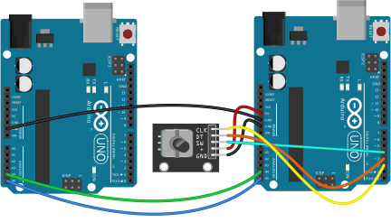
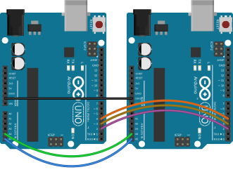

# Purpose

This library provides an interface for a rotary encoder module with i2c connection.
See this [repository](https://github.com/resterampeberlin/Encoder-Module) for the hardware and this [repository](https://github.com/resterampeberlin/rr_Encoder-i2c) for the necessary firmware.

# Installation

# Documentation

For source code documentation see this [page](https://resterampeberlin.github.io/rr_Encoder-i2c/).

# Testing

For testing purpose I recommend to use two Arduino Uno - one configured and wired as the I2C module
and the other as the host.
Just connect SDA/SCL/GND of both and you are ready.
The advantage is, that you can use the serial terminal to see debugging output from both peripherals. 
As encoder you can use the usual KY-040. 
Note that in this case all signals are pulled up, i.e. inverted.

## Static testing

Connect the following pins:

| Controller  | Encoder     | KY-040      |
| ----------- | ----------- | ----------- |
| GND         | GND         | GND         |
|             | 5V          | 5V          |
| A4 / SDA    | A4 / SDA    |             |
| A5 / SCL    | A5 / SCL    |             |
|             | D2          | CLK         |
|             | D3          | DT          |
|             | D4          | SW          |

Run the test with `pio test --filter "*Static"`

## Dynamic testing

In this case the controller Arduino will also act as a simulated encoder and send the signals to the simulated encoder Arduino.

Connect the following pins:

| Controller  | Encoder     | 
| ----------- | ----------- | 
| GND         | GND         | 
| A4 / SDA    | A4 / SDA    |  
| A5 / SCL    | A5 / SCL    | 
| D2 = CLK    | D2          | 
| D3 = DT     | D3          | 
| D4 = SW     | D4          | 

Run the test with `pio test --filter "*Dynamic"`

# Credits

This open source code project is has been proudfully produced in Berlin (and other places around the globe) by

